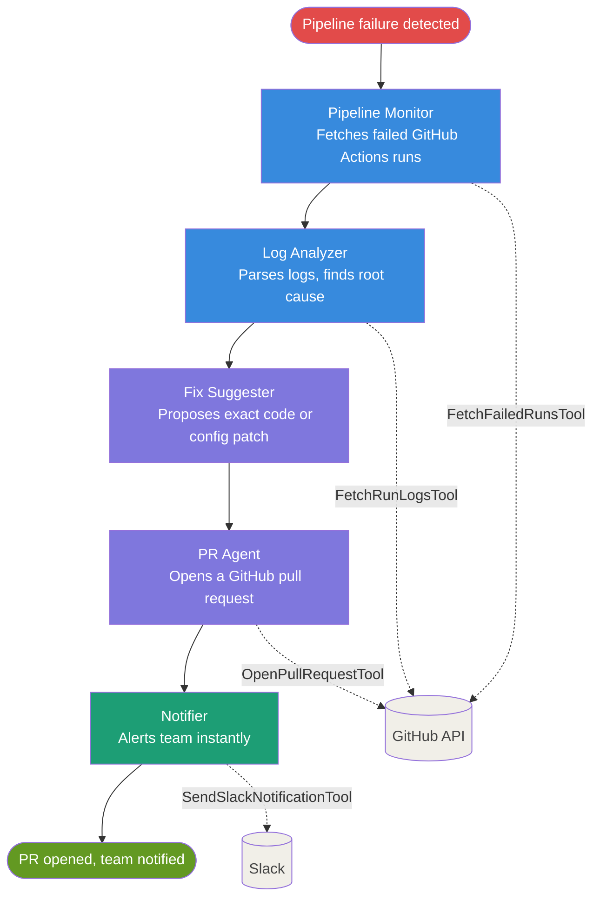
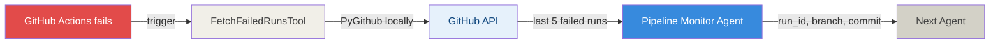
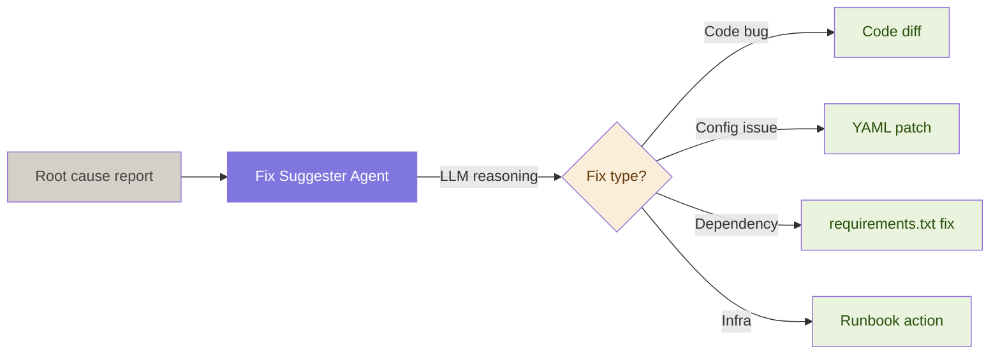
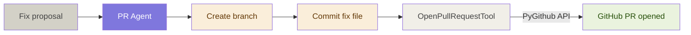
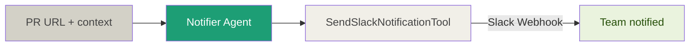
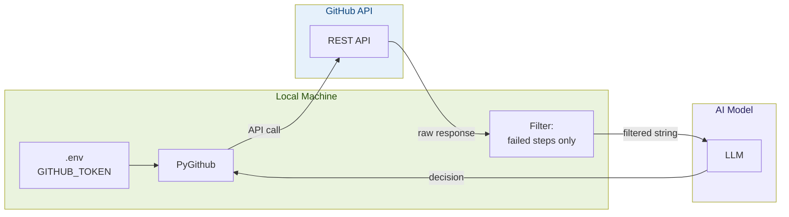
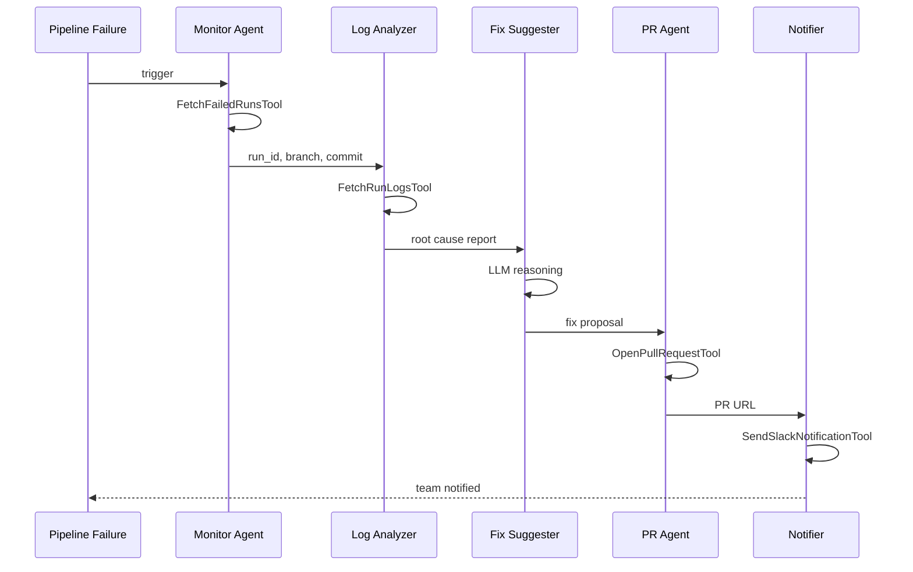

# Autonomous CI/CD Pipeline Analyzer

> A 5-agent CrewAI system that detects pipeline failures, analyzes root causes, proposes fixes, opens pull requests, and notifies the team — automatically.

---

## The Problem

Every pipeline failure costs time:

```
❌ Pipeline fails
👀 Developer notices (maybe 10 min later)
🔍 Digs through logs (15–30 min)
🧠 Figures out root cause (10–20 min)
🛠 Writes a fix (10–30 min)
📬 Opens a PR (5 min)
📢 Notifies the team (5 min)

Total: 30 minutes → 2 hours. Every. Single. Time.
```

**This project does all of that in under 3 minutes. Automatically.**

---

## How It Works

### Overview



---

### Step 1 — Pipeline Monitor detects failure



Extracts for each failure:
- Run ID, workflow name, branch
- Commit SHA, failure timestamp, run URL

---

### Step 2 — Log Analyzer finds the root cause

```mermaid
flowchart LR
    A[Run ID] --> B[FetchRunLogsTool]
    B -->|PyGithub API| C[GitHub API]
    C -->|raw job logs| D[Filter failed steps only]
    D -->|filtered string| E[Log Analyzer Agent]
    E -->|root cause report| F[Next Agent]

    style A fill:#D3D1C7,color:#444
    style B fill:#F1EFE8,color:#444
    style C fill:#E6F1FB,color:#0C447C
    style D fill:#FAEEDA,color:#633806
    style E fill:#378ADD,color:#fff
    style F fill:#D3D1C7,color:#444
```



Raw logs are filtered — only failed steps reach the AI:

```
# Thousands of lines from GitHub — AI never sees this
Step: Checkout       ✅ success
Step: Setup Python   ✅ success
Step: Install deps   ❌ failure
      ERROR: Could not find a version that satisfies
      the requirement pandas==2.99.0
Step: Run tests      ⏭ skipped

# Only this filtered string reaches the AI model
=== JOB: build | failure ===
[FAILED STEP] Install deps
```

Root cause categories:
`dependency_conflict` · `test_failure` · `build_error` · `infra_issue` · `secret_env_issue`

---

### Step 3 — Fix Suggester proposes a patch



Output includes fix description, files to change, before/after diff, and confidence level.

---

### Step 4 — PR Agent opens a pull request



PR body auto-generated:

```markdown
## Problem
Build failed on main — install dependencies step

## Root Cause
pandas==2.99.0 does not exist on PyPI

## Fix
Updated requirements.txt to pandas==2.2.0

## Testing
Re-run the Build & Test workflow after merge
```

---

### Step 5 — Notifier alerts the team



Slack message:

```
Pipeline Failure Detected
━━━━━━━━━━━━━━━━━━━━━━━━━
Workflow:   Build & Test
Branch:     main
Root Cause: pandas==2.99.0 does not exist
Fix:        Updated to pandas==2.2.0
PR:         github.com/org/repo/pull/42
```

---

## Security — Does the AI access GitHub directly?

**No.** The token never leaves the local machine.



| What | Who sees it |
|---|---|
| `GITHUB_TOKEN` | Local machine only |
| Raw API response | Local machine only |
| Source code | Local machine only |
| Filtered log string | AI model |
| PR title and body | AI model (it writes these) |

---

## Agent Sequence



---

## Project Structure

```
cicd_crew/
├── agents/
│   └── agents.py          # All 5 CrewAI agents
├── tasks/
│   └── tasks.py           # Tasks with context chaining
├── tools/
│   ├── github_tool.py     # Fetch runs, fetch logs, open PR
│   └── slack_tool.py      # Slack notifications
├── crew.py                # Crew assembly
├── main.py                # CLI entrypoint
├── requirements.txt
└── .env.example
```

---

## Quick Start

### 1. Clone & install

```bash
git clone https://github.com/username/autonomous-cicd-crew
cd autonomous-cicd-crew
python3 -m venv venv
source venv/bin/activate
pip install -r requirements.txt
```

### 2. Configure environment

```bash
cp .env.example .env
nano .env
```

```env
OPENROUTER_API_KEY=sk-or-...
GITHUB_TOKEN=ghp_...
GITHUB_REPO=owner/repo-name
```

### 3. Run

```bash
# Dry run — no PR, no Slack
python main.py --dry-run

# Full run
python main.py


```

---

## Supported LLM Models

Change model in `crew.py`:

```python
llm = LLM(
    model="openrouter/openai/gpt-oss-120b:free",
    api_key=os.getenv("OPENROUTER_API_KEY"),
    base_url="https://openrouter.ai/api/v1",
    temperature=0.2,
)


## Stack

| Tool | Purpose |
|---|---|
| [CrewAI](https://crewai.com) | Multi-agent orchestration |
| [OpenRouter](https://openrouter.ai) | Free LLM API |
| [PyGithub](https://pygithub.readthedocs.io) | GitHub API access |
| [python-dotenv](https://pypi.org/project/python-dotenv) | Environment variables |

---


